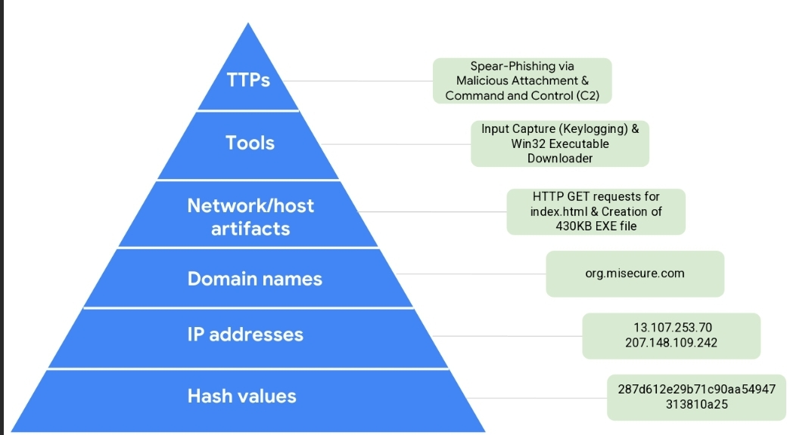

# Investigate a Suspicious File Hash

## Malware Identification

### Why this file has been identified as malicious?

The file is malicious because it was flagged by over 50 vendors on VirusTotal. Beyond reputation, the behavioral analysis shows suspicious activities such as Debug environment detection and Direct access to the processor clock, which are common anti-analysis techniques used by malware like Flagpro.

---

## Pyramid of Pain Analysis 

