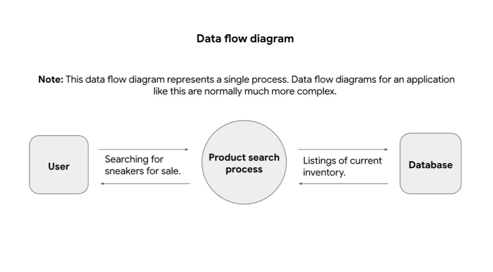
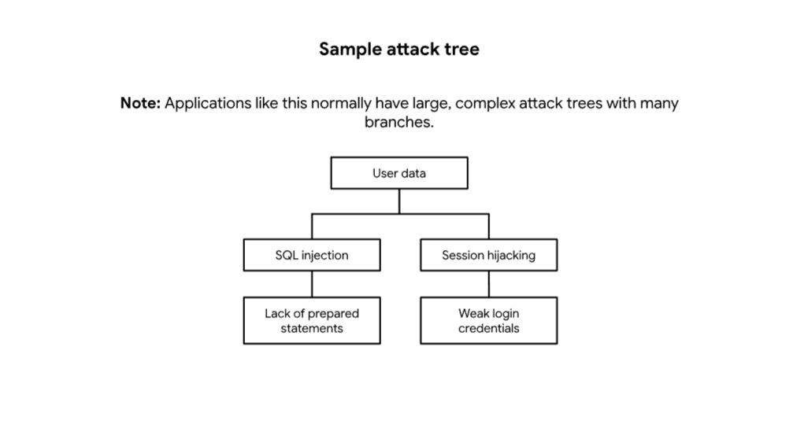

# Threat Modeling Analysis: PASTA Framework (Sneaker Company)

## Overview
This report documents the application of the **PASTA (Process for Attack Simulation and Threat Analysis)** methodology for a sneaker e-commerce platform. The objective was to evaluate the application's security posture by aligning business goals with technical risk analysis.

---

## Stage I: Define Business and Security Objectives
* **Operational Efficiency:** Ensure a seamless and high-quality user experience for both buyers and sellers within the platform.
* **Secure Communication:** Facilitate reliable and encrypted communication channels between buyers and sellers to prevent fraud and social engineering.
* **Data Privacy & Identity Management:** Implement robust account management systems to ensure the confidentiality, integrity, and availability (CIA) of user personal and financial data.

---

## Stage II: Define the Technical Scope
**Priority Assets:** SQL Database & API Endpoints.

Based on common threat actor behaviors, the SQL database is designated as the highest priority for security evaluation. Since the application handles sensitive customer data and payment information, the primary focus is on securing the backend from **SQL Injection (SQLi)** attacks.

**Defense Strategy:** Implementing defense-in-depth strategies such as salting and hashing to ensure that even in the event of a data breach, the exfiltrated data remains cryptographically useless to unauthorized parties.

---

## Stage III: Decompose the Application
This stage involves mapping the data flow to identify critical interaction points between the user and the system architecture.

### Data Flow Diagram (DFD)

**Key Observations:**
The diagram illustrates a direct connection between the **User** search query and the **Database** through the **Product search process**. This confirms the database's exposure as a primary target for data-driven attacks.

---

## Stage IV: Threat Analysis
### External Threats:
* **Phishing and Social Engineering:** Targeting administrative staff to gain unauthorized access to internal systems or sensitive credentials.
* **Automated Attacks:** Brute-force attacks against authentication interfaces and session hijacking to compromise user accounts.

### Internal Threats:
* **Accidental Data Loss:** Unintentional modification or deletion of the production database by authorized personnel due to human error.

---

## Stage V: Vulnerability Analysis
* **Improper Input Validation:** Vulnerable input fields in the authentication UI that do not properly sanitize user-supplied data, allowing the execution of malicious SQL queries.
* **Broken Authentication & Weak Session Management:** Absence of Multi-Factor Authentication (MFA) and lack of Rate Limiting mechanisms, leaving the application susceptible to credential stuffing and brute-force attempts.

---

## Stage VI: Attack Modeling
In this stage, we simulate potential exploit paths to understand how an attacker could reach the targeted data.

### Attack Tree Diagram

**Analysis of Attack Tree:**
The goal of compromising "User data" is reachable through two main technical failures:
1.  **SQL Injection:** Exploiting the lack of prepared statements.
2.  **Session Hijacking:** Exploiting weak login credentials.

---

## Stage VII: Risk Analysis and Impact
To mitigate the identified risks and strengthen the security posture, the following controls are recommended:

1.  **Parameterized Queries:** Enforce the use of prepared statements to mitigate SQL Injection risks at the code level.
2.  **Multi-Factor Authentication (MFA):** Implement mandatory MFA for all users, specifically for administrative and seller accounts, to provide an extra layer of identity assurance.
3.  **Account Lockout & Rate Limiting:** Deploy security controls to monitor and block repetitive failed login attempts from a single IP or account to thwart brute-force attacks.
4.  **Advanced Cryptographic Protections:** Utilize **SHA-256** with unique salts for password storage and **AES-256** for encrypting sensitive payment data at rest.

---

## Key Skills Demonstrated
* Threat Modeling (PASTA Methodology)
* Data Flow Analysis & Decomposing Applications
* Attack Tree Visualization
* Risk Mitigation & Security Recommendations
* Compliance Awareness (Data Privacy)
